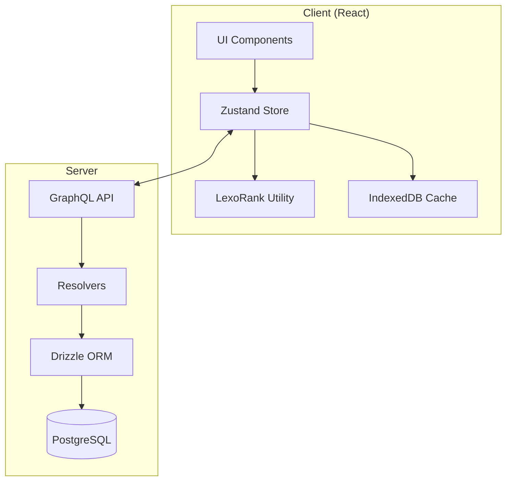
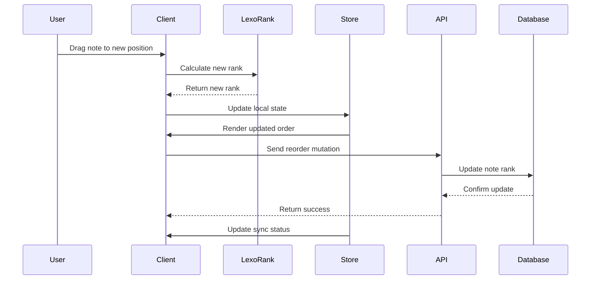
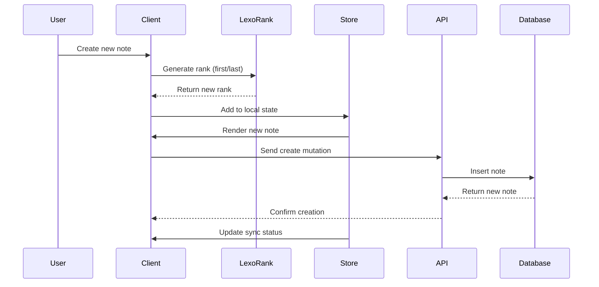
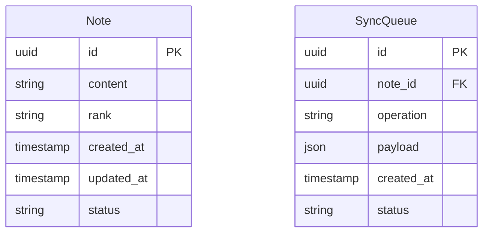
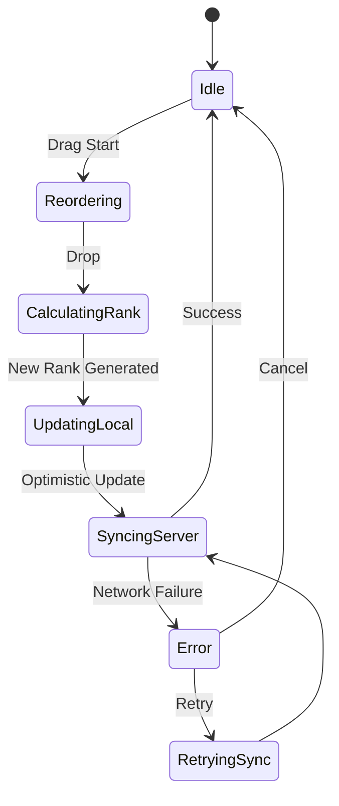
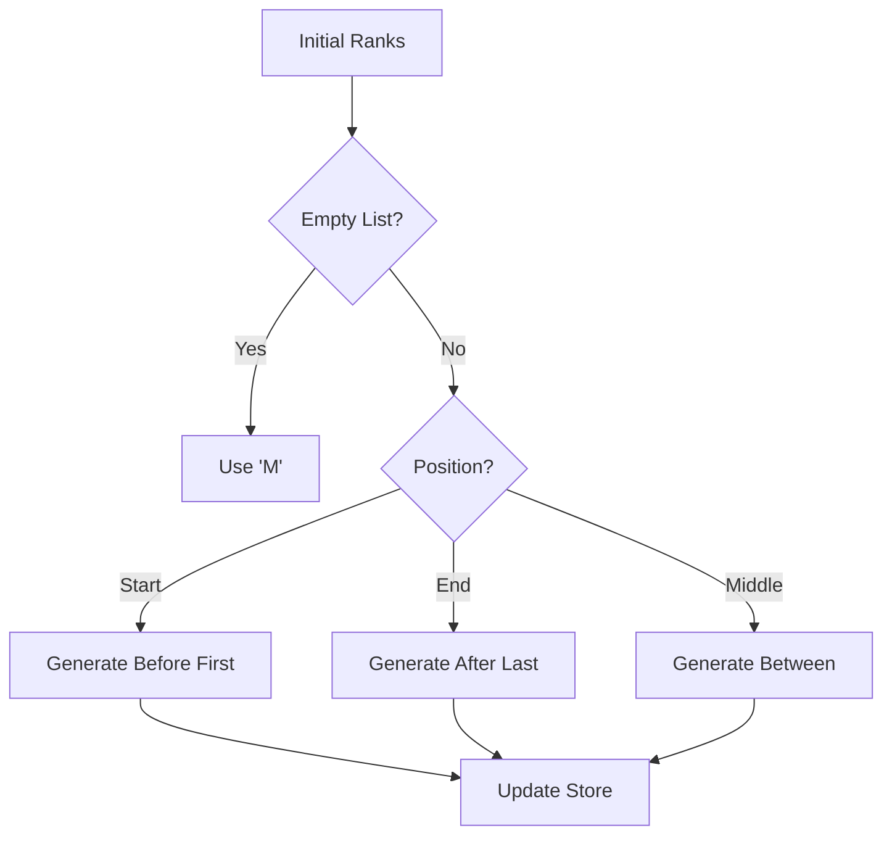
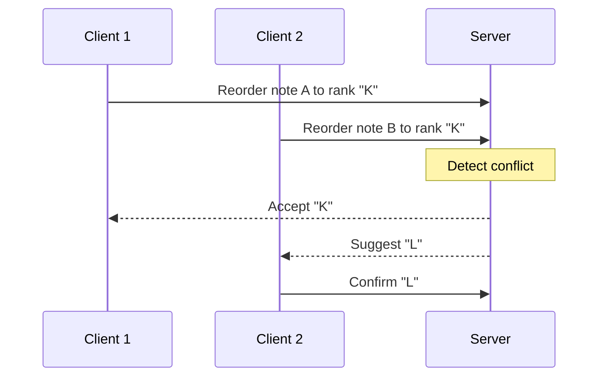
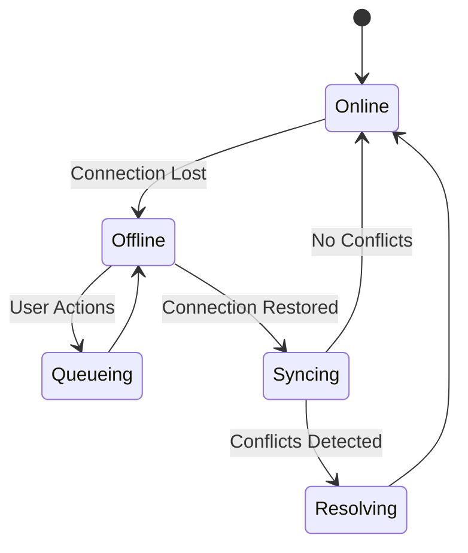

# LexoRank System Design

## Overview

This document outlines the system design for implementing LexoRank-based note ordering in Mosaic. The system provides real-time, collaborative note reordering with offline support.

## System Components



## Data Flow - Note Reordering



## Data Flow - Adding New Note



## Data Model



## Technical Details

### 1. LexoRank Implementation

```typescript
class LexoRank {
  // Character space for rank generation
  private static DIGITS = "0123456789ABCDEFGHIJKLMNOPQRSTUVWXYZ";

  // Core ranking methods
  static between(prev: string | null, next: string | null): string;
  static before(rank: string): string;
  static after(rank: string): string;
}
```

### 2. State Management Flow



### 3. Rank Distribution Strategy



## System Characteristics

### Performance

- O(1) rank generation operations
- O(log n) database operations for reordering
- Minimal network payload size

### Scalability

- Supports thousands of notes per user
- Handles concurrent updates
- No global locks required

### Reliability

- Offline-first architecture
- Optimistic updates
- Conflict resolution handling

## Edge Cases and Solutions

### 1. Concurrent Edits



### 2. Rank Exhaustion

```typescript
// When ranks get too close
'A1' -> 'A2'  // Normal case
'A1' -> 'A1A' // When no room between A1 and A2
'A1' -> 'A1M' // When needing more space
```

### 3. Offline Operations



## Implementation Considerations

1. **Client-Side**

   - Optimistic updates for instant feedback
   - Local state management with Zustand
   - IndexedDB for offline persistence
   - Batch synchronization handling

2. **Server-Side**

   - Transactional updates
   - Conflict detection and resolution
   - Efficient index usage
   - Real-time event propagation

3. **Database**
   - Indexed rank column
   - Version control for sync
   - Audit trail for changes
   - Conflict resolution data

## Monitoring and Maintenance

### Key Metrics

- Rank generation time
- Sync latency
- Conflict rate
- Storage growth

### Health Checks

- Rank distribution monitoring
- Sync queue length
- Error rates
- Performance metrics
