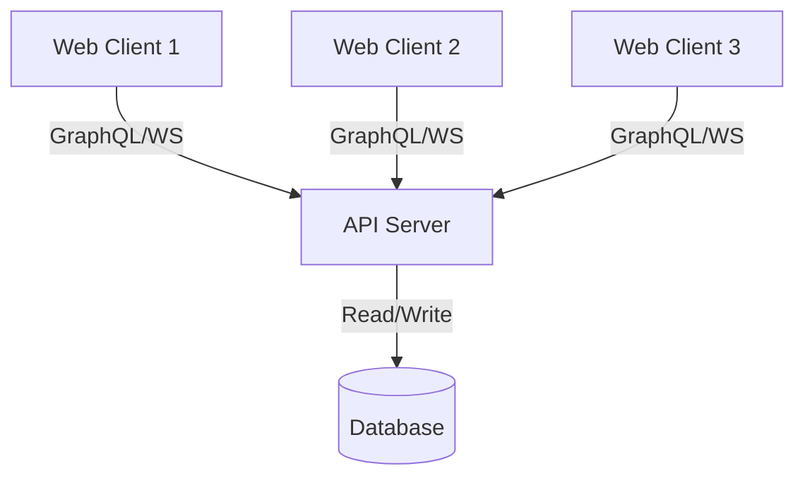
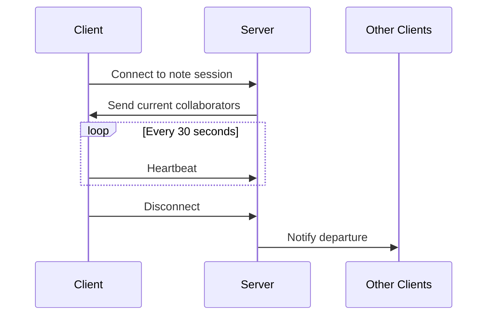

# Mosaic Real-time Collaboration System Design - MVP

**Version:** 1.0  
**Last Updated:** October 31, 2024  
**Status:** Draft

## 1. System Overview

### 1.1 Purpose

Design a real-time collaborative note-taking system that allows multiple users to simultaneously edit and view notes with minimal latency and conflict resolution.

### 1.2 MVP Architecture Diagram



## 2. Technical Architecture

### 2.1 Technology Stack

- **Frontend:**

  - React.js
  - GraphQL WebSocket Client (graphql-ws)
  - Mosaic Block Editor

- **Backend:**
  - Node.js
  - GraphQL Yoga
  - WebSocket Server (ws)
  - PostgreSQL

### 2.2 Key Components

#### 2.2.1 GraphQL API Layer

```graphql
type Note {
  id: ID!
  content: String!
  version: Int!
  lastModified: String!
  modifiedBy: String!
  collaborators: [User!]!
}

type Mutation {
  updateNote(input: UpdateNoteInput!): Note!
  addCollaborator(noteId: ID!, userId: ID!): Note!
}

type Subscription {
  noteUpdated(id: ID!): Note!
  collaboratorPresence(noteId: ID!): PresenceEvent!
}
```

#### 2.2.2 Real-time Communication

- WebSocket connections for subscriptions
- In-memory PubSub for broadcasting changes
- Simple presence tracking

## 3. Data Flow

### 3.1 Note Update Flow

1. Client sends update via GraphQL mutation
2. Server validates request
3. Server applies update to database
4. Server broadcasts change to all connected clients
5. Clients merge changes using OT algorithm

### 3.2 Presence System



## 4. Data Models

### 4.1 Database Schema

```sql
-- Notes Table
CREATE TABLE notes (
    id UUID PRIMARY KEY,
    content TEXT NOT NULL,
    version INTEGER NOT NULL,
    last_modified TIMESTAMP NOT NULL,
    modified_by UUID REFERENCES users(id),
    created_at TIMESTAMP NOT NULL
);

-- Collaborators Table
CREATE TABLE note_collaborators (
    note_id UUID REFERENCES notes(id),
    user_id UUID REFERENCES users(id),
    access_level VARCHAR(20) NOT NULL,
    joined_at TIMESTAMP NOT NULL,
    PRIMARY KEY (note_id, user_id)
);
```

## 5. Operational Considerations

### 5.1 Initial Performance Metrics

- Target Metrics:
  - Latency: < 200ms for updates
  - Concurrent users per note: Up to 5
  - Maximum note size: 500KB
  - WebSocket connections per server: 1,000

### 5.2 Basic Monitoring

- Server health checks
- WebSocket connection status
- Database connection pool metrics
- Error rate monitoring

## 6. Security Considerations

### 6.1 Authentication & Authorization

- JWT-based authentication
- Basic role-based access control
- WebSocket connection authentication

## 7. Conflict Resolution

### 7.1 Operational Transformation

- Character-wise OT implementation
- Basic server-side validation
- Client-side state management

```typescript
interface Operation {
  type: "insert" | "delete";
  position: number;
  chars?: string;
  length?: number;
  userId: string;
  timestamp: number;
}
```

## 8. Future Considerations

### 8.1 Scalability Improvements

- Load balancing for multiple servers
- Redis for PubSub and caching
- Database read replicas
- CDN integration
- Horizontal scaling strategy

### 8.2 Advanced Features

- Offline support with sync
- Rich text formatting
- Document history
- Comments and annotations
- Real-time cursors
- End-to-end encryption
- CRDT implementation
- Enhanced monitoring and alerting

### 8.3 Performance Optimizations

- Redis caching for:
  - Note content
  - User sessions
  - Presence information
- Database query optimization
- WebSocket connection pooling

## 10. Error Handling

### 10.1 Error Types

- Network errors
- Validation errors
- Authorization errors
- Conflict errors

### 10.2 Recovery Procedures

- Automatic reconnection
- State reconciliation
- Basic error reporting
